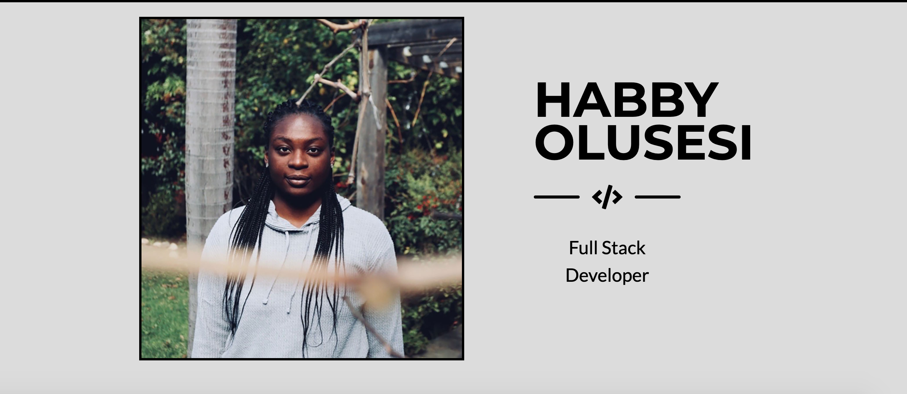
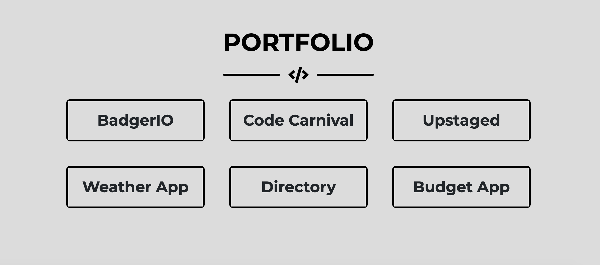

# Portfolio

## Description

This is a portfolio that displays a professional bio as well as links to a handful of projects that I've worked on. It also provides my resume and contact information for any interested parties.

## Table of Contents

* [Project Summary](#description)
* [Preview](#preview)
* [Deployed App](#app)
* [Contact Me](#questions)
  
## Preview

Below are some example images of the app!

## App

Here is a link to the deployed app on GitHub Pages: 
[Portfolio](https://habby-bit.github.io/Portfolio/)

## Questions?

If you have any questions, please don't hesitate to reach out!

Github: [habby-bit](https://github.com/habby-bit)
  
Email: [habbyolu@gmail.com](habbyolu@gmail.com)
